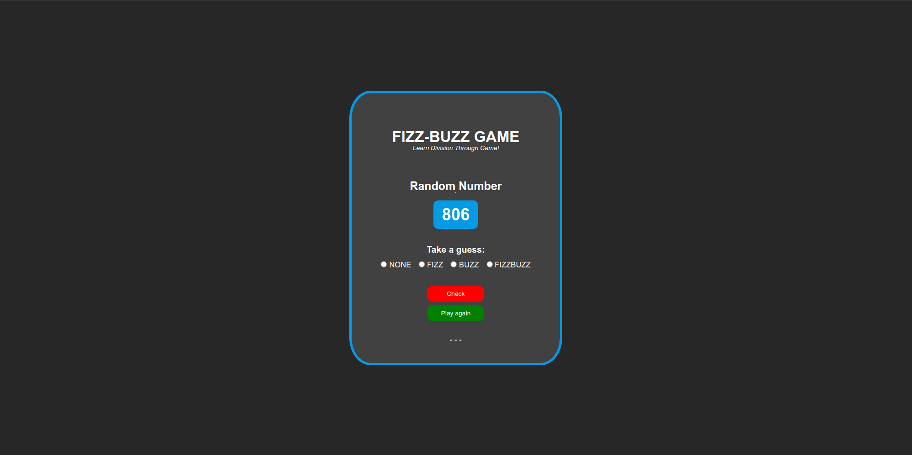
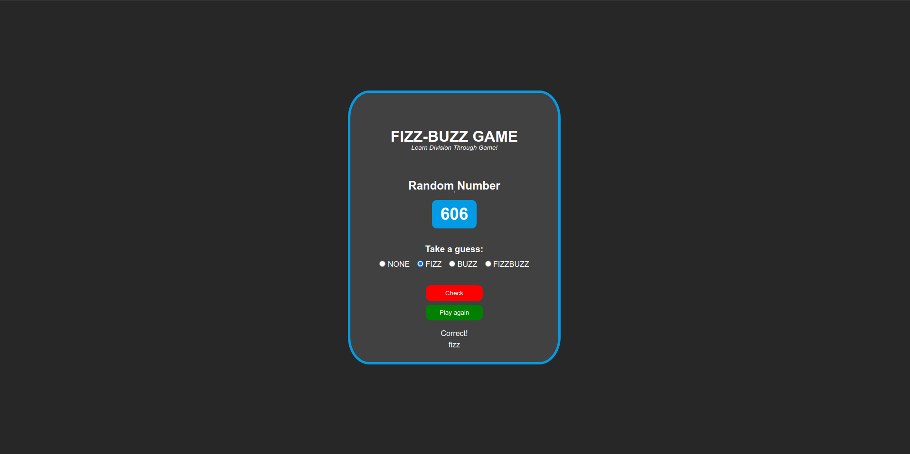

# FizzBuzz Game (shaunniekins' version)

As the traditional way of playing FizzBuzz, players take turn to count incrementally, replacing numbers divisible by three with the word "fizz" and any number divisible by five with the word "buzz". Numbers divisible by 15 become "fizz buzz".

In these version of FizzBuzz, a random number will show up, and` the player should answer or guess if the random number is "fizz" (if divisible by three), "buzz" (divisible by five), "fizzbuzz" (divisible by 15) or "none" (if it is not).

The game is exciting to play!

## Deployment

View Deployment

```bash
  https://shaunniekins.github.io/fizz-buzz/
```

## Screenshots

 